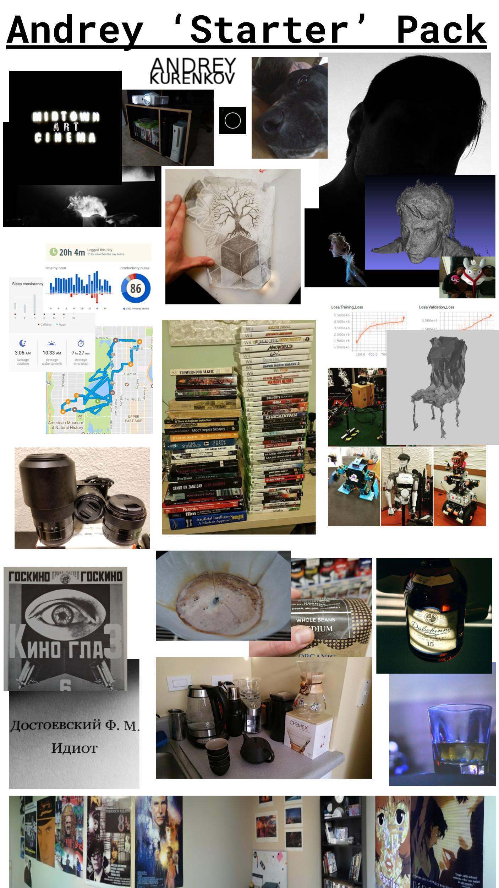

Hi there. I am Andrey Kurenkov, a grad student at Stanford that likes do research about AI and robotics, write code, appreciate art, and ponder about life. 

Currently, I am a PhD student with the [Stanford Vision and Learning Lab](http://svl.stanford.edu/home) working at the intersection of robotics and computer vision, and am advised by Silvio Savarese. 

This site documents my various projects, my writing (technical and not), my photography, and my YouTube videos. I am also quite active on [Twitter](https://twitter.com/andrey_kurenkov).

> "I love writing. I get a kick out of sharing my thoughts with others. The act of transforming ideas into words is an amazingly efficient way to solidify and refine your thoughts about a given topic. " -Tom Preston (creator of Jekyll), [Blogging Like a Hacker](http://tom.preston-werner.com/2008/11/17/blogging-like-a-hacker.html)

If you are so curious, I am more specifically interested in: 

* AI/machine learning (increasingly, the  deep kind)
* cinema (Tarkovsky, Aronofsky, Kaufman, Kurosawa, Bergman, Carruth, Kon, Miyazaki, Zvyagintsev, etc)
* robotics (particularly, intelligent robotics that can interact with humans)
* video games (mostly narrative-driven, all the indie stuff, and the Mass Effect-type stuff, and so on)
* energy/climate change (this is what led me to my EE degree)
* books (hard science fiction, modernist, some post-modernist, some pre-modernist)
* programming (especially embedded programming, but also scripting and hackathon types things as well)
* photography (doing it, as you can see on this site, but also appreciating)

Or, in visual terms:

